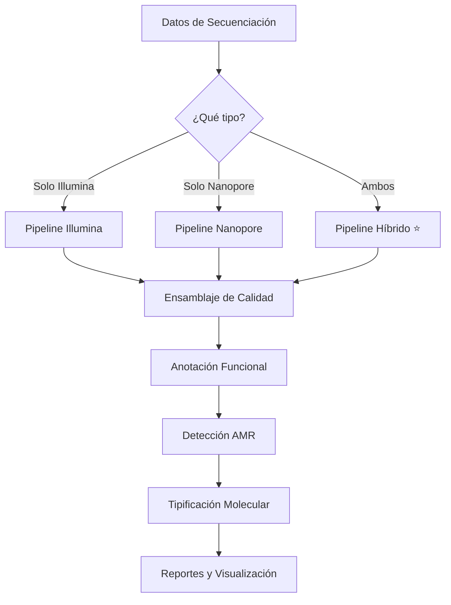

# 🧬 Bacterial Genomics Pipeline
### Análisis Completo de Genomas Bacterianos con NGS

[](https://opensource.org/licenses/MIT)
[]()
[]()

---

## 📋 Descripción

Pipeline modular para análisis de genomas bacterianos utilizando datos de secuenciación de nueva generación (NGS). Soporta **tres estrategias independientes** de ensamblaje según los datos disponibles:

- 🔵 **Solo Illumina** - Lecturas cortas de alta precisión
- 🟢 **Solo Nanopore** - Lecturas largas para mayor continuidad  
- 🟣 **Híbrido** - Combina ambas tecnologías (recomendado)

Además incluye análisis exhaustivo de **resistencia antimicrobiana (AMR)**, anotación funcional y tipificación molecular.

---

## 🚀 Inicio Rápido

### ¿Qué tipo de datos tienes?

| Tus Datos | Pipeline Recomendado | Tiempo Estimado | Ir a Documentación |
|-----------|---------------------|-----------------|-------------------|
| 📘 Solo Illumina | Pipeline Illumina | 3-5 horas | [Ver guía →](docs/01_ILLUMINA_PIPELINE.md) |
| 📗 Solo Nanopore | Pipeline Nanopore | 2-4 horas | [Ver guía →](docs/02_NANOPORE_PIPELINE.md) |
| 📕 Illumina + Nanopore | **Pipeline Híbrido** ⭐ | 5-8 horas | [Ver guía →](docs/03_HYBRID_PIPELINE.md) |

> **💡 Recomendación**: Si tienes ambos tipos de datos, usa el pipeline híbrido para obtener la **mejor calidad** (continuidad de Nanopore + precisión de Illumina).

---

## 📚 Documentación Completa

### 1️⃣ Instalación y Configuración (EMPEZAR AQUÍ)
**📄 [00_INSTALLATION.md](docs/00_INSTALLATION.md)**

- Instalación de Conda/Mamba
- Creación de 3 ambientes especializados
- Descarga de bases de datos (AMRFinder, CARD, etc.)
- Verificación de instalación
- Configuración del proyecto

**⏱️ Tiempo:** ~45 minutos | **Espacio:** ~50 GB | **Solo una vez**

---

### 2️⃣ Pipelines de Ensamblaje

#### 📘 Pipeline Solo Illumina
**📄 [01_ILLUMINA_PIPELINE.md](docs/01_ILLUMINA_PIPELINE.md)**

**Ideal para:**
- ✅ Detección precisa de SNPs/INDELs
- ✅ Análisis de variantes de alta confianza
- ✅ Cuando solo tienes datos Illumina

**Incluye:**
- Control de calidad con FastQC/fastp
- Ensamblaje con SPAdes
- Mapeo con BWA
- Llamado de variantes con BCFtools

**Limitaciones:**
- ⚠️ Ensamblajes fragmentados (50-150 contigs)
- ⚠️ Dificulta cierre de plásmidos

---

#### 📗 Pipeline Solo Nanopore
**📄 [02_NANOPORE_PIPELINE.md](docs/02_NANOPORE_PIPELINE.md)**

**Ideal para:**
- ✅ Genomas altamente contiguos (2-10 contigs)
- ✅ Cierre de cromosomas y plásmidos
- ✅ Resolver regiones repetitivas
- ✅ Cuando solo tienes datos Nanopore

**Incluye:**
- Control de calidad con NanoPlot
- Filtrado con Filtlong
- Ensamblaje con Flye
- Mapeo con Minimap2
- Polishing con Medaka

**Limitaciones:**
- ⚠️ Mayor tasa de errores (especialmente indels)
- ⚠️ Menos preciso para SNP calling

---

#### 📕 Pipeline Híbrido (Recomendado ⭐)
**📄 [03_HYBRID_PIPELINE.md](docs/03_HYBRID_PIPELINE.md)**

**Lo mejor de ambos mundos:**
- ✅ Alta continuidad (Nanopore)
- ✅ Alta precisión (Illumina)
- ✅ Cromosomas y plásmidos cerrados
- ✅ SNPs/INDELs confiables
- ✅ **Mejor calidad general**

**Incluye:**
- QC de ambas tecnologías
- Ensamblaje híbrido con Unicycler
- Validación cruzada
- Consenso de alta confianza

**Requerimientos:**
- 🔴 Datos de Illumina paired-end
- 🔴 Datos de Nanopore long-reads
- 🔴 Mayor tiempo de cómputo

---

### 3️⃣ Análisis Downstream (Común para Todos)

#### 🛡️ Resistencia Antimicrobiana y Tipificación
**📄 [04_AMR_TYPING.md](docs/04_AMR_TYPING.md)**

**Análisis incluidos:**
- Detección de genes AMR (AMRFinderPlus, Abricate, RGI)
- Anotación funcional (Prokka/Bakta)
- MLST typing
- Detección de plásmidos
- Factores de virulencia
- Reportes consolidados

**Bases de datos:**
- NCBI AMRFinder
- CARD (Comprehensive Antibiotic Resistance Database)
- ResFinder
- VFDB (Virulence Factor Database)
- PlasmidFinder

---

### 4️⃣ Solución de Problemas
**📄 [05_TROUBLESHOOTING.md](docs/05_TROUBLESHOOTING.md)**

- Errores comunes de instalación
- Problemas de memoria/disco
- Calidad baja de datos
- Fallos en ensamblaje
- Conflictos de dependencias

---

## 🎯 Caso de Estudio: *Klebsiella pneumoniae* URO5550422

Todos los pipelines están documentados usando un caso real:

- **Organismo:** *Klebsiella pneumoniae*
- **Muestra:** URO5550422 (aislado clínico urinario)
- **Referencia:** K. pneumoniae HS11286 (GCF_000240185.1)
- **Genoma:** 5.7 Mb (1 cromosoma + 6 plásmidos)
- **Datos disponibles:** Illumina paired-end + Nanopore long-reads

---

## 📊 Comparación de Estrategias

| Característica | Illumina | Nanopore | Híbrido |
|---------------|----------|----------|---------|
| **Número de contigs** | 50-150 | 2-10 | 1-10 |
| **N50** | 100-300 kb | 5+ Mb | 5+ Mb |
| **Precisión** | >99.9% | ~95-98% | >99.99% |
| **Continuidad** | Baja | Alta | Alta |
| **Plásmidos cerrados** | No | Sí | Sí |
| **Costo computacional** | Bajo | Medio | Alto |
| **Tiempo ejecución** | 3-5h | 2-4h | 5-8h |
| **SNP calling** | Excelente | Regular | Excelente |
| **Mejor para** | Variantes | Estructura | Todo |

---

## 💻 Requisitos del Sistema

### Hardware Mínimo
- **CPU:** 4 cores
- **RAM:** 16 GB
- **Almacenamiento:** 100 GB por muestra
- **Sistema:** Linux/Unix (Ubuntu 20.04+)

### Hardware Recomendado
- **CPU:** 8+ cores
- **RAM:** 32+ GB
- **Almacenamiento:** SSD con 200 GB por muestra
- **Red:** Conexión estable para descargas

---

## 📦 Instalación Rápida

```bash
# 1. Clonar repositorio
git clone https://github.com/tu-usuario/Bacterial_Genomics_Pipeline.git
cd Bacterial_Genomics_Pipeline

# 2. Seguir guía de instalación
# Ver: docs/00_INSTALLATION.md
bash scripts/setup_environments.sh

# 3. Verificar instalación
bash scripts/verify_installation.sh

# 4. Elegir tu pipeline según tus datos
# - Solo Illumina: docs/01_ILLUMINA_PIPELINE.md
# - Solo Nanopore: docs/02_NANOPORE_PIPELINE.md  
# - Híbrido: docs/03_HYBRID_PIPELINE.md
```

---

## 🗂️ Estructura del Repositorio

```
Bacterial_Genomics_Pipeline/
│
├── README.md                      # Este archivo - índice principal
│
├── docs/                          # 📚 Documentación detallada
│   ├── 00_INSTALLATION.md        # Instalación y setup
│   ├── 01_ILLUMINA_PIPELINE.md   # Pipeline Illumina
│   ├── 02_NANOPORE_PIPELINE.md   # Pipeline Nanopore
│   ├── 03_HYBRID_PIPELINE.md     # Pipeline híbrido
│   ├── 04_AMR_TYPING.md          # AMR y tipificación
│   └── 05_TROUBLESHOOTING.md     # Solución de problemas
│
├── workflows/                     # 🔧 Scripts organizados por tecnología
│   ├── illumina/
│   │   ├── 01_qc.sh
│   │   ├── 02_assembly.sh
│   │   └── 03_mapping.sh
│   ├── nanopore/
│   │   ├── 01_qc.sh
│   │   ├── 02_assembly.sh
│   │   └── 03_mapping.sh
│   ├── hybrid/
│   │   ├── 01_qc.sh
│   │   └── 02_assembly_hybrid.sh
│   └── common/                    # Scripts compartidos
│       ├── 04_annotation.sh
│       ├── 05_amr_detection.sh
│       └── 06_typing.sh
│
├── envs/                          # 🐍 Ambientes conda
│   ├── bact_main.yml
│   ├── bact_amr.yml
│   └── bact_rgi.yml
│
├── scripts/                       # 🚀 Scripts de utilidades
│   ├── setup_environments.sh
│   ├── verify_installation.sh
│   └── setup_project_structure.sh
│
└── test_data/                     # 🧪 Datos de prueba (pequeños)
```

---

## 🔄 Flujo de Trabajo General



---

## ✅ Checklist de Decisión

### ¿Qué pipeline debo usar?

- [ ] **¿Tengo datos Illumina paired-end?**
  - Sí → Puedes usar pipeline Illumina o Híbrido
  - No → Usa pipeline Nanopore

- [ ] **¿Tengo datos Nanopore long-reads?**
  - Sí → Puedes usar pipeline Nanopore o Híbrido
  - No → Usa pipeline Illumina

- [ ] **¿Tengo AMBOS tipos de datos?**
  - ✅ Sí → **USA PIPELINE HÍBRIDO** (mejor opción)

- [ ] **¿Necesito plásmidos cerrados?**
  - Sí → Requiere Nanopore o Híbrido
  - No → Illumina es suficiente

- [ ] **¿Priorizo precisión en SNPs?**
  - Sí → Illumina o Híbrido
  - No → Nanopore puede ser suficiente

---

## 🎓 Para Empezar

### Usuarios Nuevos
1. **Leer:** [00_INSTALLATION.md](docs/00_INSTALLATION.md)
2. **Instalar:** Ambientes conda (~45 min)
3. **Elegir:** Tu pipeline según datos disponibles
4. **Ejecutar:** Pipeline paso a paso
5. **Analizar:** Resultados AMR y tipificación

### Usuarios Avanzados
- Revisar documentación específica de tu pipeline
- Modificar scripts según necesidades
- Integrar con tus propios workflows
- Contribuir con mejoras (pull requests bienvenidos)

---

## 📖 Referencias y Recursos

### Herramientas Principales
- **FastQC/fastp:** Control de calidad
- **SPAdes:** Ensamblaje Illumina
- **Flye:** Ensamblaje Nanopore
- **Unicycler:** Ensamblaje híbrido
- **BWA/Minimap2:** Mapeo de lecturas
- **Prokka:** Anotación funcional
- **AMRFinderPlus/CARD:** Detección AMR

### Bases de Datos
- NCBI RefSeq
- CARD (Comprehensive Antibiotic Resistance Database)
- ResFinder
- VFDB (Virulence Factors)
- PubMLST

### Publicaciones
- Wick et al. (2017) - Unicycler: https://doi.org/10.1371/journal.pcbi.1005595
- Kolmogorov et al. (2019) - Flye: https://doi.org/10.1038/s41587-019-0072-8
- Bankevich et al. (2012) - SPAdes: https://doi.org/10.1089/cmb.2012.0021

---

## 🤝 Contribuir

¿Encontraste un bug? ¿Tienes una sugerencia?

1. Abre un **Issue** describiendo el problema
2. Envía un **Pull Request** con mejoras
3. Comparte tus casos de uso
4. Ayuda a mejorar la documentación

---

## 📄 Licencia

Este proyecto está licenciado bajo MIT License - ver archivo [LICENSE](LICENSE)

---

## 📧 Contacto y Soporte

- **Issues:** [GitHub Issues](https://github.com/tu-usuario/Bacterial_Genomics_Pipeline/issues)
- **Discusiones:** [GitHub Discussions](https://github.com/tu-usuario/Bacterial_Genomics_Pipeline/discussions)
- **Email:** tu-email@ejemplo.com

---

## 🌟 Agradecimientos

Este pipeline integra herramientas desarrolladas por la comunidad científica y bioinformática. Agradecemos a todos los desarrolladores de:

- Bioconda project
- Galaxy project  
- NCBI
- CARD
- PubMLST
- Y todos los creadores de herramientas open-source

---

<div align="center">

**¿Listo para empezar?**

[📚 Ir a Instalación](docs/00_INSTALLATION.md) | [📘 Pipeline Illumina](docs/01_ILLUMINA_PIPELINE.md) | [📗 Pipeline Nanopore](docs/02_NANOPORE_PIPELINE.md) | [📕 Pipeline Híbrido](docs/03_HYBRID_PIPELINE.md)

---

⭐ **Si este proyecto te fue útil, considera darle una estrella en GitHub** ⭐

</div>
